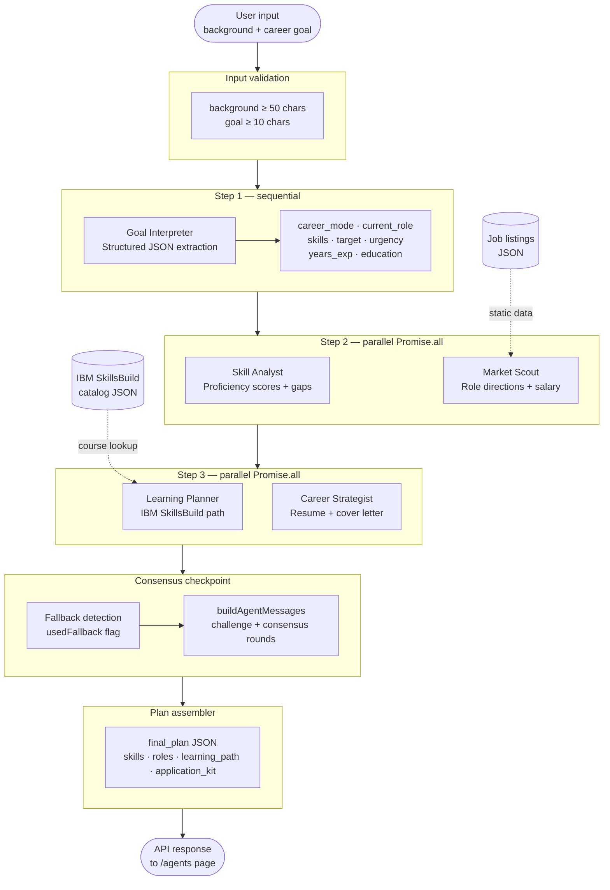

# Consensus

**AI-powered career planning using a multi-agent IBM watsonx pipeline.**

Consensus takes your professional background and career goal, runs them through a parallel agent pipeline powered by IBM Granite, and returns a complete plan: skill gaps, target roles, a sequenced IBM SkillsBuild learning path, and a rewritten resume and cover letter — all in one shot.

---

## Agent Pipeline


The pipeline runs in three sequential steps, with agents executing in parallel where possible to minimize latency:

**Step 1 — Goal Interpreter**
The first agent to run. It reads the user's raw background and goal text and produces structured JSON that every downstream agent depends on: career mode (`transition`, `level_up`, or `new_graduate`), current role, extracted skills mentioned, target direction, urgency, years of experience, and education. Nothing downstream runs until this completes.

**Step 2 — Parallel: Skill Analyst + Market Scout**
Both agents run simultaneously via `Promise.all()`.

- **Skill Analyst** maps the user's existing skills with proficiency scores (0–100) and identifies gaps — rated `critical`, `high`, or `nice_to_have`. It also writes 2–3 transferable strength statements explaining how existing skills map to the target role.
- **Market Scout** independently analyzes the job market and recommends 3 role directions ranked by reachability. For each it gives a skill overlap percentage, salary range, market demand, readiness assessment, and a stepping-stone path. It also generates a salary trajectory (current → after transition → 5-year potential).

**Step 3 — Parallel: Learning Planner + Career Strategist**
Runs after Step 2 completes, using both agents' outputs as input.

- **Learning Planner** receives the detected skill gaps and target roles, then selects courses exclusively from the IBM SkillsBuild catalog (`src/data/skillsbuild-catalog.json`). It builds two paths: Phase 1 (fastest route to the most reachable role) and Phase 2 (stretch goal). Optimized for speed-to-employability.
- **Career Strategist** receives the background and top role, then produces 3 rewritten resume bullets with before/after and reasoning, a 3-paragraph cover letter, 3–4 interview talking points, and a one-sentence positioning strategy.

**Consensus Checkpoint**
Before the response is assembled, a fallback detection pass runs. If any agent failed (threw an error calling Granite), a covering agent injects a `build`-type message into the conversation notifying the user that results may be less personalized. All four agent outputs are then merged into a single `final_plan` JSON.

**Plan Assembler**
Merges all agent outputs into the structured response returned to the client:

```
{
  agent_messages: [...],      // the full multi-round agent conversation
  final_plan: {
    skills: { existing, gaps, transferable_strengths },
    roles: { directions, salary_impact },
    learning_path: { phase_1, phase_2 },
    application_kit: { resume_rewrites, cover_letter, interview_tips, positioning }
    consensus_summary: "..."
  }
}
```

---

## Tech Stack

| Layer | Technology |
|-------|------------|
| Framework | Next.js 16 (App Router) |
| Language | TypeScript |
| Styling | Tailwind CSS v4 |
| Animations | Framer Motion |
| AI Model | IBM watsonx `ibm/granite-3-8b-instruct` |
| Auth (IBM) | IAM token exchange (`/identity/token`) |
| Data | IBM SkillsBuild catalog JSON, job listings JSON |

---

## Project Structure

```
src/
├── app/
│   ├── page.tsx                    # Home / landing page with pipeline diagram
│   ├── start/page.tsx              # Input form: background + goal
│   ├── agents/page.tsx             # Live agent conversation view
│   ├── plan/
│   │   ├── page.tsx                # Main plan dashboard (skills, roles, learning path, jobs)
│   │   └── reasoning/page.tsx      # Full agent reasoning log
│   └── api/
│       └── generate-plan/route.ts  # Core agent pipeline — all 4 Granite agents
├── lib/
│   ├── api.ts                      # API types + mock data (used for dev/fallback)
│   └── utils.ts                    # Tailwind utility helpers
├── data/
│   ├── skillsbuild-catalog.json    # IBM SkillsBuild course catalog
│   └── job-listings.json           # Static job listings for plan page
└── components/
    └── ui/                         # Shared UI components (card, spotlight, spline)
```

---

## Key Files Explained

### `src/app/api/generate-plan/route.ts`
The entire agent pipeline lives here as a single Next.js API route. Key functions:

- `getIAMToken()` — exchanges the IBM API key for a Bearer token, with 1-hour caching so it doesn't re-auth on every request.
- `callGranite(prompt)` — sends a prompt to `ibm/granite-3-8b-instruct` with `temperature: 0.3` (low enough for consistent JSON output, high enough for variation).
- `parseJSON(text)` — strips markdown code fences and finds the first valid JSON object in the response, with backtracking for truncated outputs.
- `runAgent(name, prompt, fallback)` — wraps any agent call with error handling. If Granite throws, it returns the fallback data and sets `usedFallback: true`.
- `buildAgentMessages(...)` — constructs the multi-round conversation shown on the `/agents` page, including a challenge round where Career Strategist pushes back on Market Scout's top recommendation, and a consensus round where Skill Analyst confirms the two-phase plan.
- `POST handler` — validates input (background ≥ 50 chars, goal ≥ 10 chars), runs the three-step pipeline, assembles the response.

All four agent prompts include `ANTI_HALLUCINATION` as a prefix — an instruction telling Granite to only use information explicitly present in the input.

### `src/app/plan/page.tsx`
The main output page. Reads `final_plan` from `sessionStorage` (written by the `/agents` page after the API call completes). Contains:

- `SKILLSBUILD_KEYWORD_MAP` — a 13-entry keyword map that routes AI-generated skill names to the correct SkillsBuild course path URL, used when the Learning Planner doesn't return an exact catalog URL.
- `getSkillsBuildUrl(skillName, courseName)` — resolves skill gap cards to real `skillsbuild.org` links by checking catalog path names, catalog skill tags, and keyword map in order. Placeholder course names like "See SkillsBuild catalog" are skipped.
- Four stat cards (skills identified, top role match %, upskill hours, phase 1 salary) that all read directly from `finalPlan` — no hardcoded fallbacks.

### `src/app/agents/page.tsx`
Streams the agent conversation as animated cards. Each card shows the agent name, message type (`proposal`, `challenge`, `build`, `consensus`), a confidence circle rendered as an SVG, and the message body. The page calls the API route, writes `final_plan` to `sessionStorage`, and navigates to `/plan` when done.

### `src/lib/api.ts`
Type definitions and mock data. The mock agent conversation, skill data, roles, and plan here are used in development and as the shape contract for the real API response.

---

## Fallback Behavior

Every agent call is wrapped in a try/catch. If IBM Granite is unavailable or returns unparseable output, the agent silently falls back to realistic mock data (a client-services-to-business-analyst scenario). The `/agents` page surfaces a notice when fallback data is used. This ensures the demo never fully breaks, even without a live watsonx connection.

---

## Built With

- [IBM watsonx](https://www.ibm.com/watsonx) — Granite 3 8B Instruct
- [IBM SkillsBuild](https://skillsbuild.org) — course catalog and learning paths
- [Next.js](https://nextjs.org)
- [Framer Motion](https://www.framer.com/motion)
- [Tailwind CSS](https://tailwindcss.com)

---

*NCCU IBM watsonx Hackathon — 2026*
